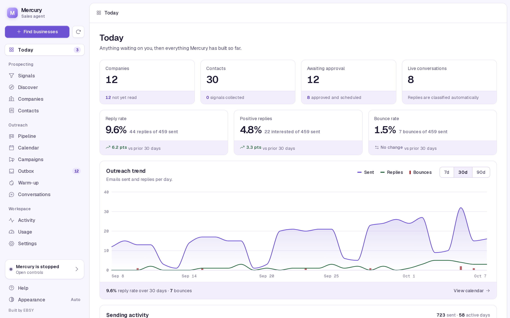
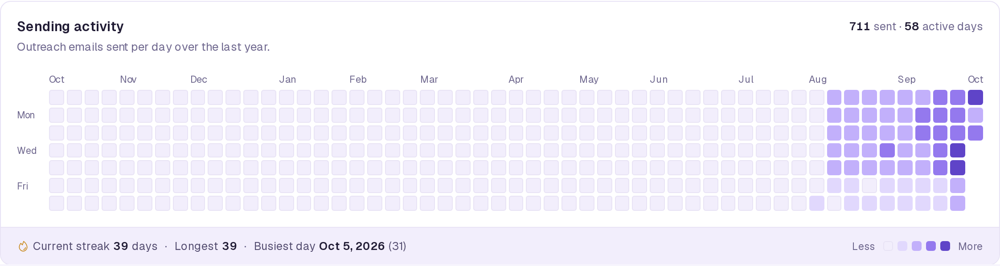
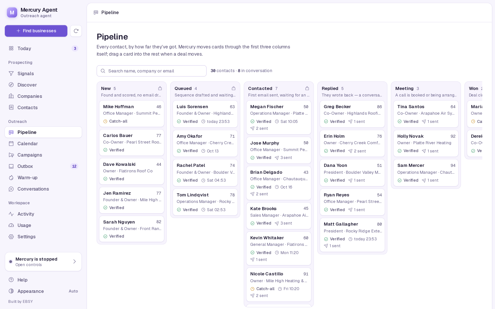
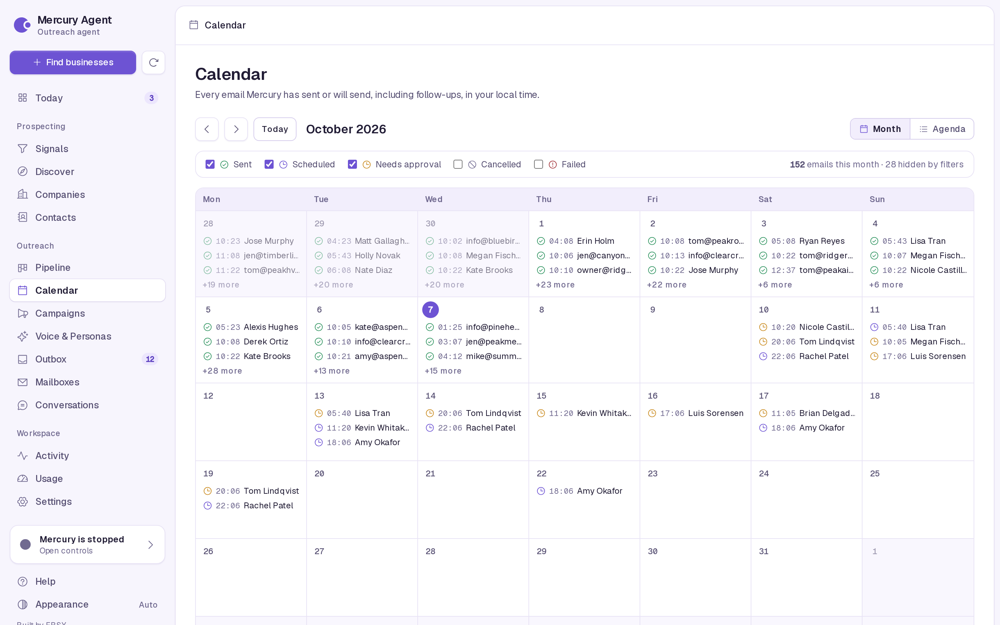
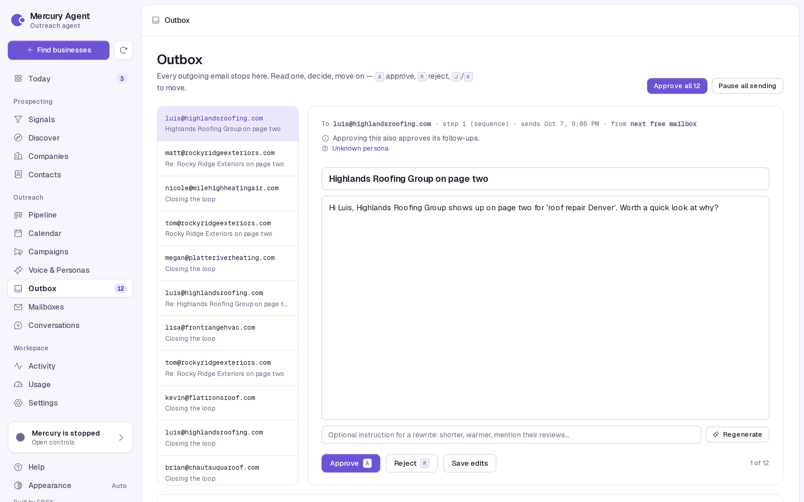
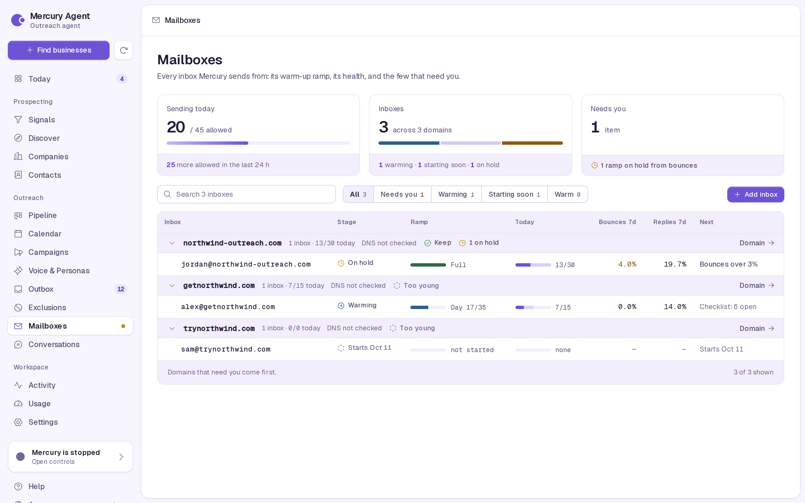

# Dashboard

`mercury dashboard` serves a local web UI on port 5555. It opens on Today, which shows anything waiting on a decision first and then how the pipeline is doing. The other tabs let you confirm signals, run discovery, review and approve email, move deals, manage sending mailboxes and their warm-up, and read what Mercury did. This page walks through each tab and explains how to reach the dashboard from another machine safely.

```bash
mercury dashboard                          # http://127.0.0.1:5555
mercury dashboard --port 8080
mercury dashboard --host 100.101.102.103   # a specific interface, e.g. your tailnet IP
```

The dashboard reads and writes the same SQLite database as `mercury run`, and the two can run at the same time. It does not run the heartbeat itself. Most views refresh every 15 seconds while visible; the Outbox and Settings tabs do not auto-refresh, so a draft or form you are editing is never re-rendered under you. The Inbox refreshes, but never replaces a reply or note you are typing. The theme follows your system until you pick light or dark with the button at the bottom of the sidebar.

## Today



The landing page answers "is anything waiting on me?"

- **KPIs**: Companies (and how many are not yet profiled), Contacts, Awaiting approval (and how many are approved and scheduled), Live conversations. Each card opens its tab.
- **Rates**: reply rate, positive reply rate and bounce rate over the trend window selected below, each with the change against the previous window of the same length. Rates are fractions of outreach emails sent. Bounce rate turns red at 5%.
- **Outreach trend**: emails sent, replies and bounces per day over 7, 30 or 90 days. Click a legend item to hide a series.
- **Sending activity**: a year-long grid of outreach emails sent per day, with total, active days, the current and longest streak, and the best day.
- **Needs you**: decisions only you can make, most blocking first: sending paused, setup incomplete, signals awaiting confirmation, no companies yet, companies not profiled, emails waiting for approval, replies Mercury could not process, inbox reminders that are due, live conversations. Each due reminder gets its own row (who, which company, your note) with **Open conversation**. A reminder only flags its conversation; nothing is sent from Today.
- **Pipeline**: a funnel from businesses found to profiled, contacts, drafted emails and live conversations.
- **Recent activity**, **Quick actions** (confirm signals, find businesses, review the outbox, see the calendar, export prospects), the setup checklist while setup is incomplete, and **Collector runs** (the latest discovery and profiling jobs with what they found and cost).



How the numbers are counted (`mercury/metrics.py`), all by UTC day:

| Metric | Definition |
|---|---|
| Sent | Outbox rows with status `sent` and kind `sequence`. Mercury's own replies are not outreach and are excluded. |
| Replies | Human replies, at most one per prospect per day. Out-of-office auto-replies are excluded. |
| Positive | Replies classified `interested`. |
| Bounces | Bounce events, at most one per prospect per day. |

There is no open or click rate: Mercury sends plain text with no tracking pixels. Reply rate is the honest measure.

## Signals

Every signal Mercury knows how to collect, grouped into Discovery, Profile, People and Contactability, each with a description, what it costs, and how many companies already carry it. Confirm or reject one signal or a whole category. Nothing is collected until you confirm it.

The **cohort builder** at the bottom counts, live, the companies that carry all the signals you require and none you exclude, and lists up to 200 of them. See [Prospecting](prospecting.md#signals).

The **Pains** view beside it lists the problems Mercury may write about, in the owner's words: what is waiting on you, what you confirmed (with the emails sent and replies each one earned) and what you rejected. Confirm or reject from the list, or open one to edit the words, the scene, what it costs, the market and trade it applies to, the confirmed signals that make it apply, the offer that answers it and the evidence. **Add a pain** writes one by hand. A reason on a rejection is optional. Editing never changes a status, and a pain changed elsewhere while you edit is flagged instead of overwritten. See [The pain library](pains.md).

## Discover

Provider cards show what each discovery source does, its cost and free tier, which `.env` keys it needs, and whether it is ready. Pick one, adjust cities (one per line; defaults to your ICP), results per query, search depth and the spend cap, then press **Estimate cost**. The Run button stays disabled until you have an estimate. Runs happen in the background; **Stop** ends a run between queries. When there are unprofiled companies, a button reads their sites for free.

Running a provider here also makes it the provider for the daily background discovery run. See [Daily background discovery](prospecting.md#daily-background-discovery).

## Companies

Every business Mercury has recorded. Click a row to see its contacts.

## Contacts

Everyone Mercury has found or you imported, with title, company, email status and score. **Export deliverable CSV** downloads verified and risky addresses; **Export all** downloads everything.

**Import CSV** opens the import panel. Choose a file, check the column mapping, then review the preview: counts of new, needs-enrichment, duplicate and invalid rows, and a row table you can filter. Untick a row to leave it out. Invalid rows have to be left out before the Import button enables. After the import, **Recent imports** lists each batch with how many contacts are still held and unverified, plus **Verify** (shows the credit cost first) and **Release** (hands verified contacts to outreach). Imported contacts show their batch and row in the Source column, and a "needs ..." note when they lack a name or title. See [Importing a list](prospecting.md#importing-a-list).

## Pipeline



Every contact as a card in one of seven columns:

| Column | Set by | Meaning |
|---|---|---|
| New | Mercury (locked) | Found and scored, no email drafted yet. |
| Queued | Mercury (locked) | Sequence drafted and waiting to send. |
| Contacted | Mercury (locked) | First email sent, waiting for an answer. |
| Replied | Mercury or you | They wrote back; a conversation is open. |
| Meeting | you | A call is booked or being arranged. |
| Won | you | Deal closed. |
| Lost | Mercury or you | Said no, opted out, or went cold. |

You cannot drag a card into the first three columns; Mercury owns those. Moving a card by hand:

| Move to | Prospect status | Conversation | Queued emails |
|---|---|---|---|
| Replied | `replied` | A closed conversation reopens at `engaged`. | kept |
| Meeting | `meeting` | Stage set to `closing` (reopened if it was closed). | **cancelled** |
| Won | `closed` | `closed_won`, closed. | **cancelled** |
| Lost | `lost` | `closed_lost`, closed. | **cancelled** |

Cancelling stops follow-ups from going to someone you are already talking to or have closed. Drag and drop, or use the keyboard: focus a card, <kbd>Enter</kbd> opens its details, <kbd>M</kbd> opens the move menu (arrow keys to choose). The search box filters by name, company or email. Each column shows up to 200 cards, most recent activity first.

## Calendar



Every email Mercury has sent or will send, including follow-ups and replies, in your browser's local time. Switch between Month and Agenda views; filter by Sent, Scheduled, Needs approval, Cancelled and Failed. Click an email to read it and, while it is pending or approved, approve, reject or **reschedule** it to a new time (not in the past). With mailbox rotation, each email shows which address it goes out from.

## Campaigns

The sequences the Writer produced, with their steps and the prospects in each.

## Voice & Personas

Create named writing profiles with a tone, writing preferences and examples.
Each profile has a local DiceBear Critters avatar; **Shuffle avatar** or choose
one from the picker. Set a default for future campaigns, duplicate a profile to
try another voice, or archive it without losing its historical attribution.
Changing the writing preferences creates a new version. Renaming a profile or
changing its avatar does not.

**Current configuration** shows the default voice, sender identity, product,
offer, market language settings and email behavior. **Prompt & preview** shows
the shared Writer template and knowledge. Choose a contact and a saved persona
version to inspect the assembled prompt without making a model call, or generate
a sample email. Samples use a model call but never create a campaign or an
outbox item.

Persona labels in the Outbox open an email's generation history: the original
draft, the exact prompt, the persona version and any regeneration instruction.
Sent emails retain that history alongside their final sent text and mailbox.
When sending starts, the approved text and persona are frozen together; edits
and regeneration are rejected. If a process stops during a provider call, the
row remains in **Sending** for reconciliation with the mailbox rather than
automatically sending a possible duplicate.
Emails written before history tracking show **Unknown persona**. This release
collects attribution for future persona reports and A/B tests; it does not yet
assign experiment variants or calculate persona conversion rates.

## Outbox



The decisions desk. Every outgoing email stops here while `require_approval` is on. The desk shows one pending email at a time with its recipient, step, scheduled time and sending mailbox.

| Key | Action |
|---|---|
| <kbd>A</kbd> | Approve (saves any unsaved edits first) |
| <kbd>R</kbd> | Reject (also rejects later steps of the same sequence) |
| <kbd>J</kbd> | Next email |
| <kbd>K</kbd> | Previous email |

Shortcuts are ignored while you are typing in a field. You can also:

- edit the subject and body and **Save edits**,
- type an optional instruction and **Regenerate**; the rewrite comes back for review,
- **Approve all** pending emails,
- **Pause all sending** / **Resume sending** (your pause only). A banner lists your pause, every hold still in force and any email already being sent; a bounce hold has its own **Clear bounce hold** button. See [Pauses and holds](email-and-deliverability.md#pauses-and-holds).

Below the desk: sending capacity per mailbox (today's cap after warm-up and health gates, sent in the last 24 hours, remaining), then approved and scheduled emails, recent sends, and failed, rejected or cancelled emails with the reason. See [The approval outbox](email-and-deliverability.md#the-approval-outbox).

## Mailboxes



Every sending inbox (gmail or smtp; Instantly runs its own warm-up) in one table, built to stay readable with dozens of inboxes:

- **Summary**: sends in the last 24 hours against today's capacity, how many inboxes are in each stage, and what needs you.
- **Search and filters**: All, Needs you, Warming, Starting soon, Warm.
- **Grouped by sending domain**, because DNS is a domain setting. Each domain row shows its MX, SPF, DKIM and DMARC result once, today's sends across its inboxes, and any issue. Domains that need you come first; with more than a dozen inboxes the healthy ones stay folded.
- **One row per inbox**: stage (scheduled, warming, warm, on hold, paused, replies only), ramp progress, today's sends against its cap, bounce and reply rate over 7 days, and what it needs next.

Click an inbox to open its drawer: what it can still send today, the ramp chart (planned cap per day from `warmup_start` to full volume against what was sent), health over 7 days, open checklist items (earlier weeks first), the full week-by-week plan, notes, and **Pause** / **Resume**. The arrows step through the other inboxes on the same domain. The gear opens **Inbox settings**: status (sending, replies only, paused), sender name, password and connection test, server settings, the daily limit and the warm-up start date. **Add inbox** in the toolbar uses the same form. Inbox settings are saved to your private mailbox configuration; restart a running Mercury agent after changing them.

Click a domain to see its DNS records, each with a plain-language fix, and every inbox on it. One fix covers all of them.

See [Mailbox rotation](email-and-deliverability.md#mailbox-rotation), [Warm-up ramp](email-and-deliverability.md#warm-up-ramp), and [Health gates](email-and-deliverability.md#health-gates).

## Inbox

Every conversation from every sending mailbox in one place, in three panes: the list, the thread with a reply box, and the contact. The sidebar count is how many conversations need you.

- **The list**: search (people, companies, subjects and message text; <kbd>/</kbd> jumps to it), the views **Needs you** (escalated to you, a draft waiting for review, or a reminder that is due), **Unread**, **Snoozed** and **All**, and filters for intent, mailbox and stage. Each row shows the intent and one flag: a draft to review, a reply scheduled to send, a reminder, a snooze, or an escalation. Pages of 25.
- **Bulk**: tick rows to mark them read, snooze them, or exclude them. Exclude asks first, because it stops every email to those addresses. The result says what happened to each one, including any that were already that way.
- **The thread**: what was really sent and what was received, in order, with system events (an exclusion, a paused sequence, a stage you set) between them. Replies that were never sent are listed apart under **Not sent**. The toolbar sets a reminder (bell), snoozes (moon), marks read or unread (envelope), and under **More** opens the contact or company or excludes them. Opening an unread conversation marks it read.
- **Replying**: Mercury's draft waits for your review. **Approve and send** (<kbd>A</kbd>) approves it to go out on Mercury's next cycle from the mailbox the thread runs through; **Schedule** approves it for a time; **Regenerate** asks what to change and writes a new draft; **Save draft** keeps your edits for later. Editing an approved reply sends it back to review. If the draft changed somewhere else after you opened it, your text stays in the box and you choose **Reload draft** or **Start a new draft from this text**. Escalated and opted-out or excluded conversations show why you cannot reply here; Mercury does not write to escalated threads, so answer those from your own mail client.
- **The contact**: role, address and whether it is verified or excluded; the company's location, domain, offer and signals; the conversation's stage (change it from the menu; a closed stage closes the conversation, and the Pipeline board follows); a reminder; and notes.

Read state, snoozes, notes and reminders live in Mercury only. They don't change anything in the mailbox.

| Key | Action |
|---|---|
| <kbd>J</kbd> / <kbd>K</kbd> | Next / previous conversation |
| <kbd>/</kbd> | Search (<kbd>Esc</kbd> clears it) |
| <kbd>A</kbd> | Approve and send the draft (not while typing) |
| <kbd>Esc</kbd> | Close a menu |

Below 1100 pixels wide the contact folds into **Contact, notes and reminder** above the thread. On a phone the list and the thread are separate screens, with the thread's tools in the top bar.

### Inbox API

The Inbox screen runs on `/api/inbox/`. What it relies on:

- **Every inbound message is stored before it is handled** (`inbound_messages`): provider, receiving mailbox, external and RFC ids, In-Reply-To and References, Date, sender, body, and the sent email it answers. Duplicates are recognised per provider, mailbox and id, so two inboxes never collide, and one message delivered to two inboxes is handled once. A failure while handling leaves the message to be retried next cycle; after five attempts it is kept as failed and flagged on Today.
- **Threads** combine emails that were really sent with stored inbound mail, each once and in order. Queued and failed drafts are listed apart. Conversations from before inbound storage show their saved text as partial history, with no mailbox or ids, and a message of ours found only there is marked recorded, never sent.
- **Read, snooze, notes and reminders are local.** They live in Mercury's database and do not change read flags in Gmail or on the IMAP server.
- **Replies go through the outbox.** A draft is bound to the contact, the mailbox the thread runs through, the message it answers and its thread headers. It starts in review whatever `require_approval` says, saving it with an old revision fails instead of overwriting newer text, and editing or regenerating an approved draft sends it back to review. The sender's gates (exclusions, opt-outs, holds, pauses, the pre-send check) apply as to any email. Escalated and opted-out conversations stay listed, but composing to them is refused with the reason.

| Route | Does |
|---|---|
| `GET /api/inbox/conversations` | A page of conversations with `total`, `next_offset`, facet counts and `segments` (how many are in Needs you, Unread, Snoozed and All under the other filters). Filters: `q`, `mailbox`, `intent`, `stage`, `prospect_status`, `status`, `read`, `attention`, `needs_you`, `response`, `snoozed` (`exclude` by default), `reminder`, plus `limit` and `offset`. |
| `GET /api/inbox/conversations/{id}` | The thread, drafts, unsent mail, notes, reminders, local state, restrictions, events (exclusion, paused sequence, stage changes), since when it has been at its stage, the company's offer and signals, and what composing would do. |
| `POST .../{id}/read`, `.../unread`, `.../snooze`, `DELETE .../snooze` | Local read state and snooze. |
| `POST .../{id}/stage` | Set the sales stage (`{"stage": ...}`). Audited. A closed stage closes the conversation and an open one reopens it; queued mail is not touched. |
| `GET/POST /api/inbox/contacts/{prospect_id}/notes`, `PATCH/DELETE /api/inbox/notes/{id}` | Contact notes. |
| `POST .../{id}/reminders`, `GET /api/inbox/reminders`, `POST /api/inbox/reminders/{id}/done`, `DELETE /api/inbox/reminders/{id}` | Reminders. |
| `POST .../{id}/drafts`, `PUT .../drafts/{item}`, `POST .../drafts/{item}/regenerate`, `/approve`, `/schedule`, `/discard` | Compose through the outbox. Every change names the `revision` it was made on. |
| `POST /api/inbox/bulk` | Read, unread, snooze, unsnooze or exclude an explicit list of conversations, with one result per conversation (`changed` is false when it was already that way). Exclude needs `"confirm": true`. |

## Activity

The last 100 actions Mercury's agents and the dashboard took: drafts staged, emails sent, replies classified, bounces, pipeline moves, reschedules.

## Usage

Your live Claude quota (5-hour and weekly windows, read the same way Claude Code's `/usage` does) and Mercury's own token usage: totals for today, 7 and 30 days, and breakdowns by agent, task, model and day. Only Mercury's own calls are counted, never your other Claude Code sessions. There are no dollar figures because subscription plans are not billed per token. `mercury usage` shows the same in the terminal.

## Settings

Credentials for the email provider, prospect search, email verification, LinkedIn and Cloudflare. Saving writes them to `.env`. Secrets are shown only as set or not set; their values are never sent back to the browser. **Sending inboxes** lets you add SMTP/IMAP addresses, update passwords and server settings, edit sending caps and warm-up dates, and test connections. Mailbox settings are saved to your private configuration; other YAML settings remain managed through the configuration file.

## Controls

Open it from the agent status card at the bottom of the sidebar. It shows whether a Mercury process started from the dashboard is running, Start and Stop buttons (Stop lets the agent finish the step it is on and shows **Stopping** until it exits), and the last 100 lines of `data/mercury.log`. That log only receives output from processes the dashboard started; `mercury run` in a terminal or under systemd logs to its own stdout (see [Deployment](deployment.md#logs)). For anything long-running, prefer a service.

## Help

What Mercury is, where its files live, where to get each API key, and fixes for common problems.

## Running it on another machine

By default the dashboard listens on `127.0.0.1`, reachable only from the same machine. To reach it from your laptop while Mercury runs on a home server or VPS, either tunnel or bind to a private interface:

```bash
# SSH tunnel: nothing exposed at all
ssh -L 5555:127.0.0.1:5555 you@server        # then open http://127.0.0.1:5555 locally

# Bind to a tailnet (Tailscale/WireGuard) or LAN address
mercury dashboard --host 100.101.102.103
```

**The dashboard has no authentication.** Anyone who can reach the port can approve and send email, pause sending, start and stop the agent, run paid discovery, and overwrite the credentials in `.env`. Bind it only to `127.0.0.1`, a tailnet address or a trusted LAN. Never bind it to `0.0.0.0` on a machine with a public IP, and never put it behind a public reverse proxy without adding authentication in front of it.

## A demo with sample data

To look around without your own data, seed a throwaway database:

```bash
python scripts/seed_demo.py              # writes data/demo.db and data/demo.mercury.yaml
MERCURY_DB_PATH=data/demo.db MERCURY_CONFIG=data/demo.mercury.yaml \
  MAILBOX_DEMO_PASSWORD=demo mercury dashboard
```

The seed creates about a dozen companies, 30 prospects across every pipeline column, two months of outreach history, three demo mailboxes (one warm and on hold, one warming, one scheduled), and an Inbox with drafts to review, an escalated and an opted-out thread, a snooze, a due reminder and notes. It refuses to touch `data/mercury.db` and never sends anything. Don't run `mercury run` with that environment.
